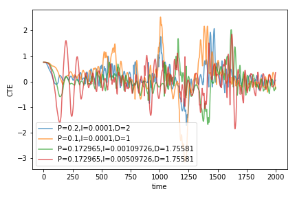

# CarND-Controls-PID
Self-Driving Car Engineer Nanodegree Program

---

## Dependencies

* cmake >= 3.5
 * All OSes: [click here for installation instructions](https://cmake.org/install/)
* make >= 4.1
  * Linux: make is installed by default on most Linux distros
  * Mac: [install Xcode command line tools to get make](https://developer.apple.com/xcode/features/)
  * Windows: [Click here for installation instructions](http://gnuwin32.sourceforge.net/packages/make.htm)
* gcc/g++ >= 5.4
  * Linux: gcc / g++ is installed by default on most Linux distros
  * Mac: same deal as make - [install Xcode command line tools]((https://developer.apple.com/xcode/features/)
  * Windows: recommend using [MinGW](http://www.mingw.org/)
* [uWebSockets](https://github.com/uWebSockets/uWebSockets)
  * Run either `./install-mac.sh` or `./install-ubuntu.sh`.
  * If you install from source, checkout to commit `e94b6e1`, i.e.
    ```
    git clone https://github.com/uWebSockets/uWebSockets 
    cd uWebSockets
    git checkout e94b6e1
    ```
    Some function signatures have changed in v0.14.x. See [this PR](https://github.com/udacity/CarND-MPC-Project/pull/3) for more details.
* Simulator. You can download these from the [project intro page](https://github.com/udacity/self-driving-car-sim/releases) in the classroom.

There's an experimental patch for windows in this [PR](https://github.com/udacity/CarND-PID-Control-Project/pull/3)

## Basic Build Instructions

1. Clone this repo.
2. Make a build directory: `mkdir build && cd build`
3. Compile: `cmake .. && make`
4. Run it: `./pid`. 

## The function of PID values

Increasing P value makes the car more responsive t cross-track error (CTE) value, but it also causes oscillations, especially when the car is driving at a high speed. Increasing D values can damp the oscillation. Ideally, controlling only P and D is enough for minimizing the CTE. However, real-world may have systematic bias that prevent the value of CTE converging, such as a long-term drifting of the car. Adding a small amount of I value could help fix this problem.


## Reflection on Tuning PID parameters for this project

I use ```(P=0.1,I=0.001,D=1)``` as my initial guess. These PID values work reasonably well and the car hit the edge of the track only once. It seems that the car should be more responsive to the change of the direction of the tracks. I increase the PD value and add a small value of I to make PID values as ```(P=0.2,I=0.001,D=2)```. I start with this value and add the twiddle algorithm to find tune the PID values. Since I intend to use the twiddle algorithm to fine tune the algorithm, I select very small dP, dD and dI values. Their initial values are 1/1000 of the P, I and D values, respectively. 
The final tuned parameter is ```(P=0.172695,I=0.00109726,D=1.75581)```. I found these PID values make the car very close of edge of the track in one of a right turn. I therefore tried increase the I value to 0.005109726 to correct this. This PID values make the car a little wobbly in the beginning but becomes stable afterwards. 
Comparisons of CTE values using these PID values are plotted below.




We can see that the final tuned parameters ```(P=0.172695,I=0.00509726,D=1.75581)``` has smaller maximum CTE error compared to our choosen initial values ```(P=0.1,I=0.001,D=1)``` despite of the first three hundreds steps. After the first three hundreds steps, the maximum absolute values of CTE is less than 2 and the deviation of CTE recovers reasonably quick.


